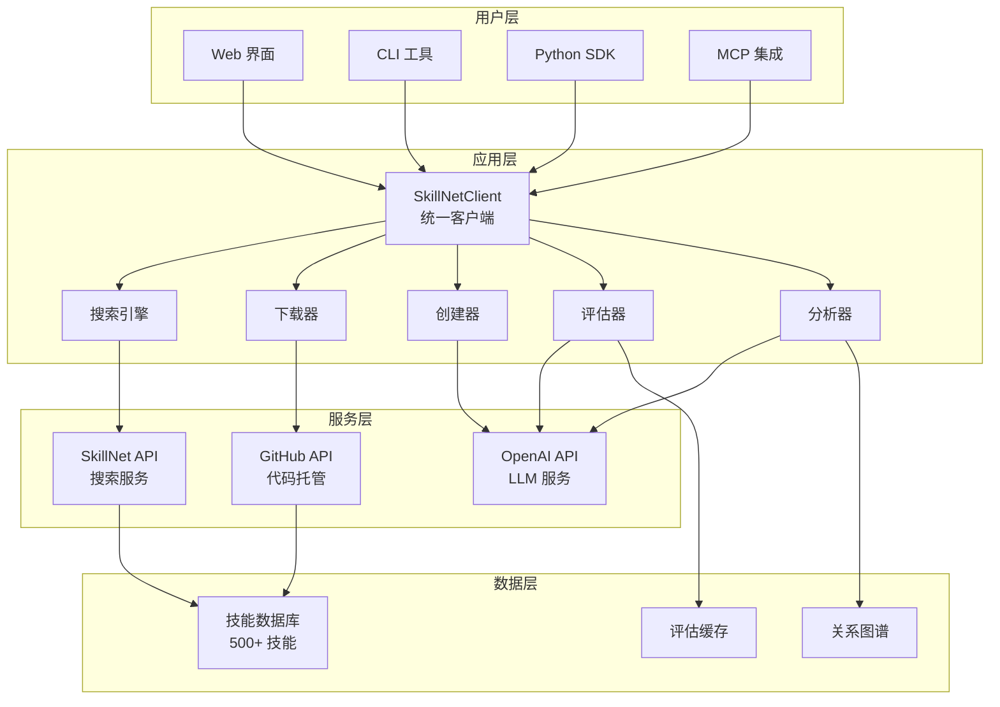
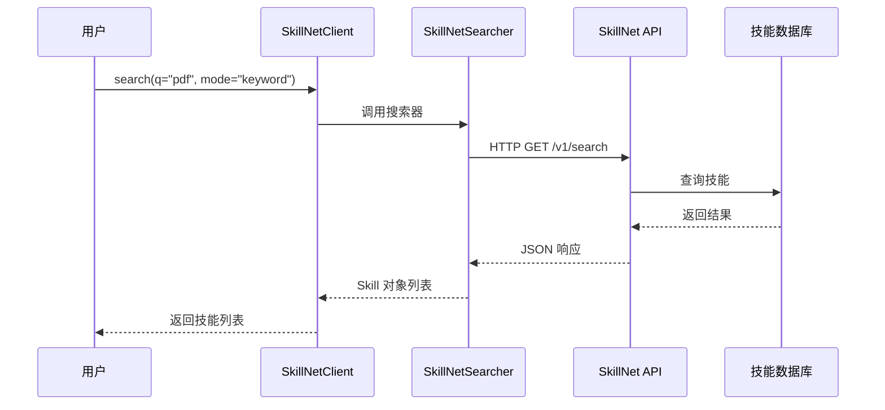
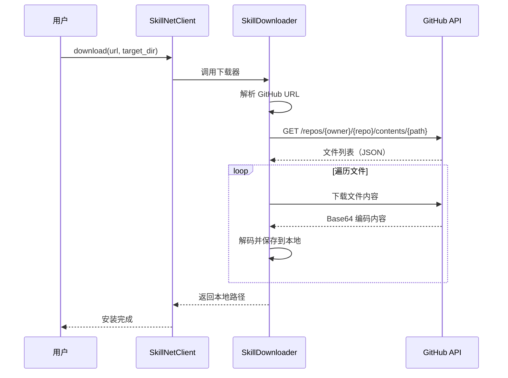
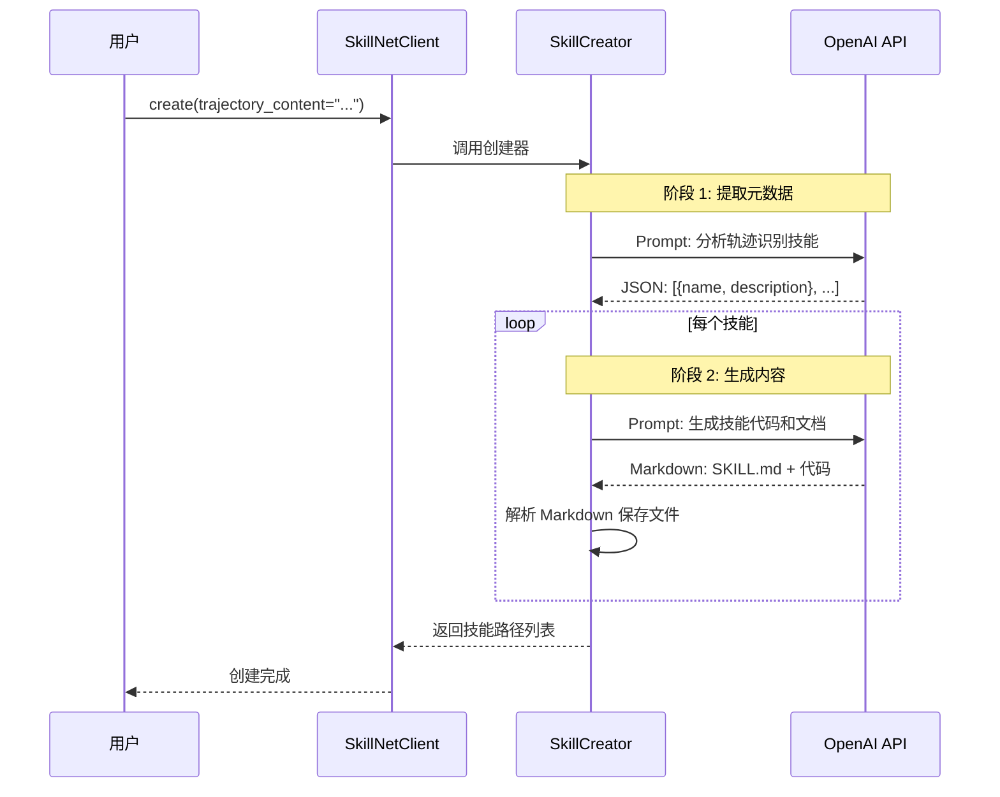
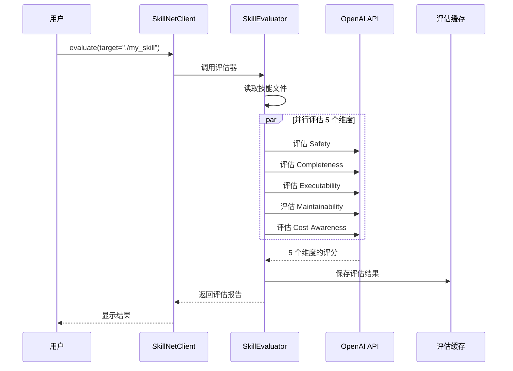
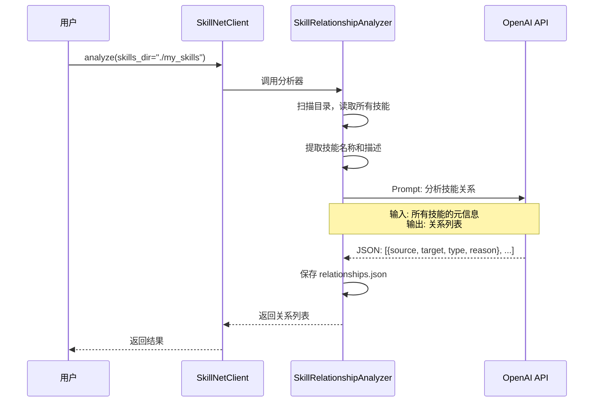
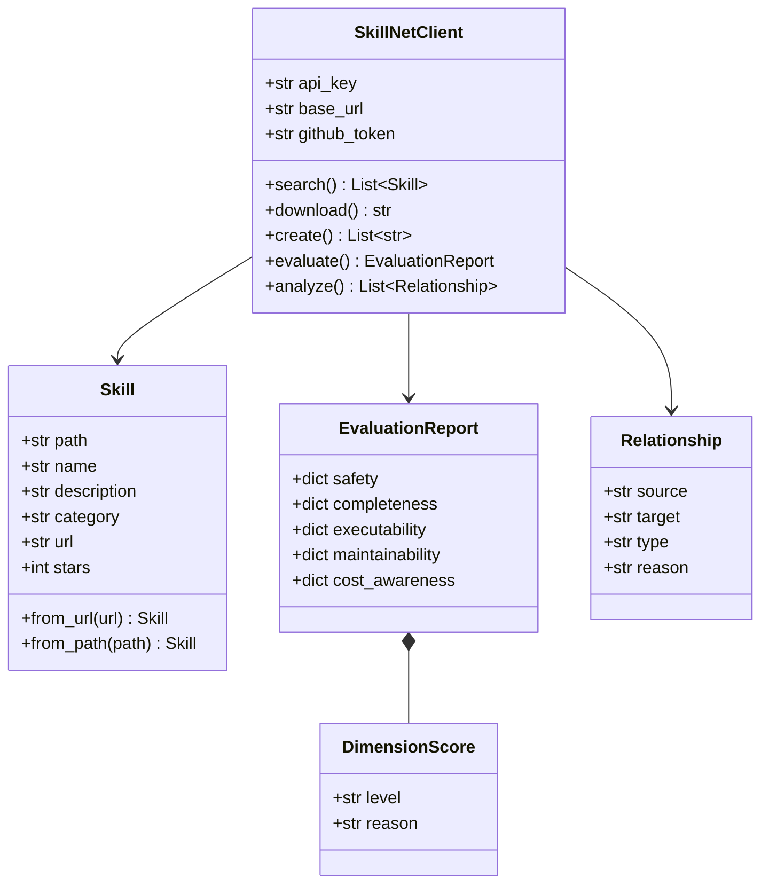
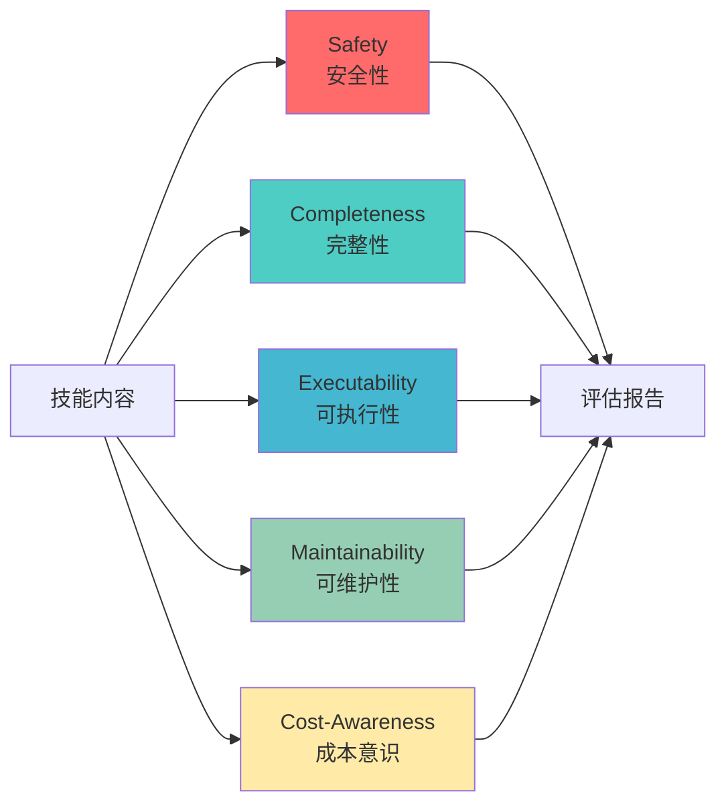
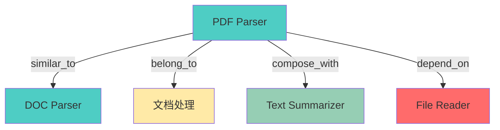

# 架构设计

本文档详细介绍 SkillNet 的系统架构、设计模式、数据流和关键技术决策。

---

## 🏗️ 系统架构总览

### 整体架构图



### 架构分层

| 层级 | 组件 | 职责 |
|------|------|------|
| **用户层** | Web/CLI/SDK/MCP | 用户交互界面 |
| **应用层** | 6 大核心模块 | 业务逻辑实现 |
| **服务层** | API 服务 | 外部服务调用 |
| **数据层** | 数据存储 | 持久化和缓存 |

---

## 🔄 核心数据流

### 1. 搜索技能流程



**关键步骤**:
1. 用户调用 `client.search()`
2. 客户端委托给 `SkillNetSearcher`
3. 搜索器调用 SkillNet API（HTTP 请求）
4. API 查询数据库
5. 返回技能列表（JSON）
6. 解析为 Skill 对象

**特点**:
- 无需认证（公开 API）
- 支持两种模式（keyword/vector）
- 分页和过滤

### 2. 下载技能流程



**关键步骤**:
1. 解析 GitHub URL（owner/repo/path）
2. 调用 GitHub Contents API 获取文件列表
3. 递归下载所有文件
4. Base64 解码并保存
5. 返回本地安装路径

**优化**:
- 支持 GitHub Token（提高速率限制）
- 支持镜像加速（国内网络）
- 错误重试机制

### 3. 创建技能流程（以轨迹为例）



**两阶段生成**:

**阶段 1**: 提取技能元数据
```
输入: 执行轨迹
↓
LLM: 识别可复用的技能模式
↓
输出: [{"name": "batch-rename", "description": "批量重命名文件"}, ...]
```

**阶段 2**: 生成技能内容
```
输入: 技能元数据 + 轨迹
↓
LLM: 生成完整技能包
↓
输出: SKILL.md + 代码文件 + 文档
```

**Prompt 设计**（见 `prompts.py`）:
- System Prompt: 定义 LLM 角色和任务
- User Prompt: 提供轨迹和技能要求
- Output Format: 指定 JSON/Markdown 格式

### 4. 评估技能流程



**并发策略**:
```python
with ThreadPoolExecutor(max_workers=5) as executor:
    futures = {
        executor.submit(self._evaluate_dimension, dim, content): dim
        for dim in dimensions
    }
    
    for future in as_completed(futures):
        result[dim] = future.result()
```

**优势**:
- 5 个维度并行评估，速度提升 5 倍
- 单个 LLM 调用失败不影响其他维度
- 缓存机制避免重复评估

### 5. 分析关系流程



**关系推断 Prompt**:
```
给定以下技能列表：
1. pdf-parser: 解析 PDF 文档
2. text-summarizer: 文本摘要
3. doc-parser: 解析 Word 文档

请分析它们之间的关系：
- similar_to: 功能相似
- belong_to: 归属类别
- compose_with: 可组合使用
- depend_on: 依赖关系

输出 JSON 格式。
```

---

## 🎨 设计模式

### 1. 门面模式（Facade）

**应用**: `SkillNetClient` 类

```python
class SkillNetClient:
    """统一接口，隐藏内部复杂性"""
    
    def search(self, ...):
        # 委托给 SkillNetSearcher
        searcher = SkillNetSearcher()
        return searcher.search(...)
    
    def download(self, ...):
        # 委托给 SkillDownloader
        downloader = SkillDownloader(...)
        return downloader.download(...)
    
    # ... 其他方法
```

**优势**:
- 用户只需学习一个类
- 内部模块可自由重构
- 统一错误处理

### 2. 策略模式（Strategy）

**应用**: 多源技能创建

```python
class SkillCreator:
    def create(self, input_type, ...):
        # 根据输入类型选择策略
        strategies = {
            "trajectory": self.create_from_trajectory,
            "github": self.create_from_github,
            "office": self.create_from_office,
            "prompt": self.create_from_prompt
        }
        
        strategy = strategies[input_type]
        return strategy(...)
```

**优势**:
- 易于添加新的创建来源
- 每种策略独立实现
- 符合开闭原则

### 3. 工厂模式（Factory）

**应用**: Skill 对象创建

```python
@dataclass
class Skill:
    path: str
    name: str
    # ...
    
    @classmethod
    def from_url(cls, url, downloader, cache_dir):
        """从 URL 创建 Skill"""
        local_path = downloader.download(url, cache_dir)
        return cls(path=local_path, name=..., url=url)
    
    @classmethod
    def from_path(cls, path):
        """从本地路径创建 Skill"""
        return cls(path=path, name=...)
```

**优势**:
- 封装对象创建逻辑
- 支持多种创建方式
- 便于测试和模拟

### 4. 模板方法模式（Template Method）

**应用**: 技能评估流程

```python
class SkillEvaluator:
    def evaluate(self, skill):
        # 模板方法定义骨架
        skill_content = self._read_skill(skill)
        
        result = {}
        for dimension in self.dimensions:
            result[dimension] = self._evaluate_dimension(
                dimension, skill_content
            )
        
        return result
    
    def _evaluate_dimension(self, dimension, content):
        # 子步骤：可被子类覆盖
        prompt = self._build_prompt(dimension, content)
        response = self._call_llm(prompt)
        return self._parse_response(response)
```

---

## 📊 数据模型

### 核心数据结构



### 数据转换流程

```
外部数据源 → 中间格式 → 标准对象 → 持久化

示例 1: 搜索结果
API JSON → dict → Skill 对象 → 返回用户

示例 2: 评估结果
技能文件 → 文本内容 → LLM 响应 → DimensionScore → EvaluationReport → JSON 文件
```

---

## 🔧 技能评估体系

### 评估维度详解



#### 1. Safety（安全性）- 权重 25%

**评估内容**:
- ✅ 无有害内容（暴力、色情、歧视）
- ✅ 无恶意代码（命令注入、文件破坏）
- ✅ 无隐私泄露（硬编码密钥、敏感数据）

**评分标准**:
- **Excellent**: 完全安全，通过所有检查
- **Good**: 基本安全，无严重问题
- **Fair**: 有潜在风险，需要注意
- **Poor**: 存在安全问题
- **Bad**: 严重安全隐患

**示例 Prompt**:
```
评估以下技能的安全性：

{skill_content}

检查点：
1. 是否包含恶意代码？
2. 是否硬编码敏感信息？
3. 是否有命令注入风险？

返回 JSON: {"level": "Good", "reason": "..."}
```

#### 2. Completeness（完整性）- 权重 20%

**评估内容**:
- 📝 文档完整（SKILL.md、README）
- 📦 依赖声明（requirements.txt、package.json）
- 🛠️ 错误处理（try-catch、异常处理）
- 📊 示例代码（examples/）

**评分标准**:
- **Excellent**: 文档齐全，依赖明确，示例丰富
- **Good**: 基本完整，少量缺失
- **Fair**: 文档简略，依赖部分缺失
- **Poor**: 文档不全，依赖不明
- **Bad**: 严重不完整

#### 3. Executability（可执行性）- 权重 25%

**评估内容**:
- ✅ 语法正确（无语法错误）
- ✅ 逻辑完整（可以实际运行）
- ✅ 依赖可安装（包存在且版本兼容）
- ✅ 测试通过（如有测试）

**评估方法**:
```python
# 1. 语法检查
ast.parse(code)  # Python
# eslint/tsc (JS/TS)

# 2. 静态分析
# pylint/mypy (Python)

# 3. 运行测试（可选）
subprocess.run(["python", "test.py"], timeout=8)
```

#### 4. Maintainability（可维护性）- 权重 15%

**评估内容**:
- 📖 代码可读性（命名、注释）
- 🏗️ 模块化（函数拆分、单一职责）
- 🎯 代码复杂度（圈复杂度、嵌套深度）

**指标**:
- 平均函数长度 < 50 行
- 最大嵌套深度 < 4 层
- 有意义的变量名

#### 5. Cost-Awareness（成本意识）- 权重 15%

**评估内容**:
- 💰 Token 使用优化（避免冗余 Prompt）
- 🔄 API 调用效率（批处理、缓存）
- ⚡ 算法复杂度（避免 O(n²) 以上）

**示例**:
```python
# ❌ 低成本意识
for item in items:
    result = llm.call(f"Process {item}")  # N 次调用

# ✅ 高成本意识
batch_prompt = "Process: " + ", ".join(items)
result = llm.call(batch_prompt)  # 1 次调用
```

### 评估结果格式

```json
{
  "safety": {
    "level": "Good",
    "reason": "无恶意代码，无硬编码密钥，但缺少输入验证"
  },
  "completeness": {
    "level": "Excellent",
    "reason": "文档齐全，依赖明确，包含丰富示例"
  },
  "executability": {
    "level": "Good",
    "reason": "语法正确，逻辑完整，但缺少单元测试"
  },
  "maintainability": {
    "level": "Fair",
    "reason": "函数过长（平均 80 行），注释不足"
  },
  "cost_awareness": {
    "level": "Good",
    "reason": "使用批处理优化 API 调用，但缺少缓存机制"
  }
}
```

---

## 🔗 技能关系图谱

### 关系类型



#### 1. similar_to（相似关系）

**定义**: 功能相似的技能

**示例**:
- `pdf-parser` ↔ `doc-parser`（都是文档解析）
- `image-resizer` ↔ `image-cropper`（都是图像处理）

**判断标准**:
- 输入输出类型相同
- 应用场景重叠
- 可相互替换

#### 2. belong_to（归属关系）

**定义**: 技能归属某个类别

**示例**:
- `pdf-parser` → `文档处理`
- `image-classifier` → `计算机视觉`

**类别体系**:
```
Development
├── 文档处理
├── 数据库操作
└── API 集成

AIGC
├── 文本生成
├── 图像生成
└── 音频处理

Research
├── 数据分析
├── 可视化
└── 机器学习
```

#### 3. compose_with（组合关系）

**定义**: 可以组合使用的技能

**示例**:
- `pdf-parser` + `text-summarizer` → PDF 摘要流程
- `web-scraper` + `data-cleaner` → 数据采集流程

**组合模式**:
```python
# Pipeline 模式
result = (
    pdf_parser.parse(file)
    .then(text_extractor.extract)
    .then(summarizer.summarize)
)
```

#### 4. depend_on（依赖关系）

**定义**: 技能依赖其他技能

**示例**:
- `pdf-parser` → `file-reader`（需要先读文件）
- `image-classifier` → `image-loader`（需要先加载图像）

**依赖图**:
```
pdf-summarizer
    ├── pdf-parser
    │   └── file-reader
    └── text-summarizer
        └── tokenizer
```

### 关系推断算法

```python
def infer_relationships(skills: List[Skill]) -> List[Relationship]:
    """使用 LLM 推断技能关系"""
    
    # 1. 提取技能元信息
    skill_info = [
        {"name": s.name, "description": s.description}
        for s in skills
    ]
    
    # 2. 构建 Prompt
    prompt = f"""
    分析以下技能之间的关系：
    {json.dumps(skill_info, ensure_ascii=False, indent=2)}
    
    返回关系列表（JSON 格式）：
    [
        {{"source": "A", "target": "B", "type": "similar_to", "reason": "..."}},
        ...
    ]
    """
    
    # 3. LLM 推断
    response = llm.call(prompt)
    
    # 4. 解析结果
    relationships = json.loads(response)
    
    return relationships
```

---

## 🚀 性能优化

### 1. 并发评估

**问题**: 5 个维度串行评估耗时长

**解决**: ThreadPoolExecutor 并行评估

```python
with ThreadPoolExecutor(max_workers=5) as executor:
    futures = {
        executor.submit(self._evaluate_dimension, dim, content): dim
        for dim in dimensions
    }
    
    for future in as_completed(futures):
        result[dim] = future.result()
```

**效果**: 速度提升 **5 倍**

### 2. 评估缓存

**问题**: 重复评估同一技能

**解决**: 本地缓存评估结果

```python
cache_key = hashlib.md5(skill_content.encode()).hexdigest()
cache_file = f"{cache_dir}/{cache_key}.json"

if os.path.exists(cache_file):
    return json.load(open(cache_file))

# 评估并缓存
result = self._evaluate(skill_content)
json.dump(result, open(cache_file, "w"))
```

### 3. GitHub 镜像

**问题**: 国内网络访问 GitHub 慢

**解决**: 支持镜像加速

```python
mirror_url = os.getenv("GITHUB_MIRROR", "https://ghfast.top/")
download_url = url.replace("https://github.com", mirror_url)
```

---

## 🔒 安全设计

### 1. 输入验证

```python
def download(self, url, target_dir):
    # 验证 URL 格式
    if not url.startswith("https://github.com"):
        raise ValueError("Invalid GitHub URL")
    
    # 验证路径安全
    target_path = os.path.abspath(target_dir)
    if not target_path.startswith(os.getcwd()):
        raise ValueError("Path traversal detected")
```

### 2. 代码隔离

```python
def evaluate(self, skill):
    # 不执行用户代码
    # 只进行静态分析
    try:
        ast.parse(code)  # 语法检查
    except SyntaxError:
        return {"executability": {"level": "Bad", "reason": "Syntax error"}}
```

### 3. Token 速率限制

```python
class RateLimiter:
    def __init__(self, max_calls=60, window=60):
        self.max_calls = max_calls
        self.window = window
        self.calls = []
    
    def acquire(self):
        now = time.time()
        self.calls = [t for t in self.calls if now - t < self.window]
        
        if len(self.calls) >= self.max_calls:
            sleep_time = self.window - (now - self.calls[0])
            time.sleep(sleep_time)
        
        self.calls.append(now)
```

---

## 📚 扩展性设计

### 添加新的评估维度

```python
# 1. 在 prompts.py 添加 Prompt
NEW_DIMENSION_PROMPT = "..."

# 2. 在 evaluator.py 添加维度
class SkillEvaluator:
    def __init__(self):
        self.dimensions = [
            "safety",
            "completeness",
            "executability",
            "maintainability",
            "cost_awareness",
            "new_dimension"  # 新增
        ]
```

### 添加新的创建来源

```python
class SkillCreator:
    def create_from_new_source(self, source_data, output_dir):
        """从新数据源创建技能"""
        # 1. 解析数据源
        parsed_data = self._parse_new_source(source_data)
        
        # 2. LLM 生成
        skills = self._generate_skills(parsed_data)
        
        # 3. 保存文件
        return self._save_skills(skills, output_dir)
```

---

[← 上一篇: 学习路径](./03-learning-path.md) | [返回首页](./README.md) | [下一篇: API 参考 →](./05-api-reference.md)
